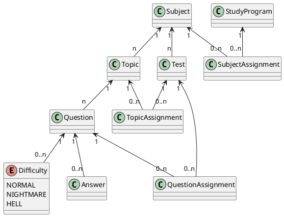

Git Repository with project form lectures is at: https://github.com/Inza/ror-plantation-v2

### Resources

* Ruby on Rails
  * Homepage: http://rubyonrails.org/
  * Guides: http://guides.rubyonrails.org/
* Bundler
  * http://bundler.io/
* Git
  * https://git-scm.com/documentation
  * http://rogerdudler.github.io/git-guide/
  * http://ohshitgit.com/
  * Git Flow
    * https://datasift.github.io/gitflow/IntroducingGitFlow.html
    * https://github.com/nvie/gitflow
* RSpec
  * http://rspec.info/
  
### Model Diagram

### Ruby Installation Tutorial

1. *[MAC ONLY]* Install Xcode from Mac App Store *(you need build tools from it)*
2. *[MAC ONLY]* Install Homebrew `https://brew.sh/`
2. *[MAC ONLY]* Install gpg `brew install gpg`
2. *[WINDOWS ONLY]* Install Ruby and Rails from Rails Installer `http://railsinstaller.org/`
2. *[WINDOWS ONLY]* Install Git for Windows `https://git-for-windows.github.io/`
2. *[MAC ONLY]* Update Git for Mac `brew install git`
3. *[MAC & Linux ONLY]* Install RVM `https://rvm.io`
2. *[MAC ONLY]* Install Xcode Command Line Tools `xcode-select --install`
4. *[MAC & Linux ONLY]* Install Ruby `2.4.2` by `rvm install 2.4.2`
5. *[MAC & Linux ONLY]* Select the installed Ruby `2.4.2` in RVM and use it by default `rvm use 2.4.2 --default`
5. *[MAC & Linux ONLY]* Install Bundler by `gem install bundler`
6. *[MAC & Linux ONLY]* Install Rails by `gem install rails`
7. We will be using Ruby `2.4.2` and Rails `5.1.4` (on Windows Ruby `2.3.3` and Rails `5.1`)
8. Go to folder where you would like to have the new app
9. Create new Rails app by `rails new my-app`
10. Go to the generate folder by `cd my-app`
11. Type `2.4.2` into `.ruby-version` (create file called `.ruby-version` and type `2.4.2` into it - or `2.3.3` on Windows)
12. Adjust `Gemfile`
13. Install all new gems (ruby dependencies) by `bundle install`
14. Run you app by `rails server` or `rails s`
15. Open `0.0.0.0:3000` (on Mac/Linux) or `localhost:3000` (on Windows) in your browser to see Rails homepage
16. *[If you cloned this git repository]* Open `0.0.0.0:3000/tests` or `127.0.0.1:3000/tests` or `localhost:3000/tests` in your browser to see the generated tests administration